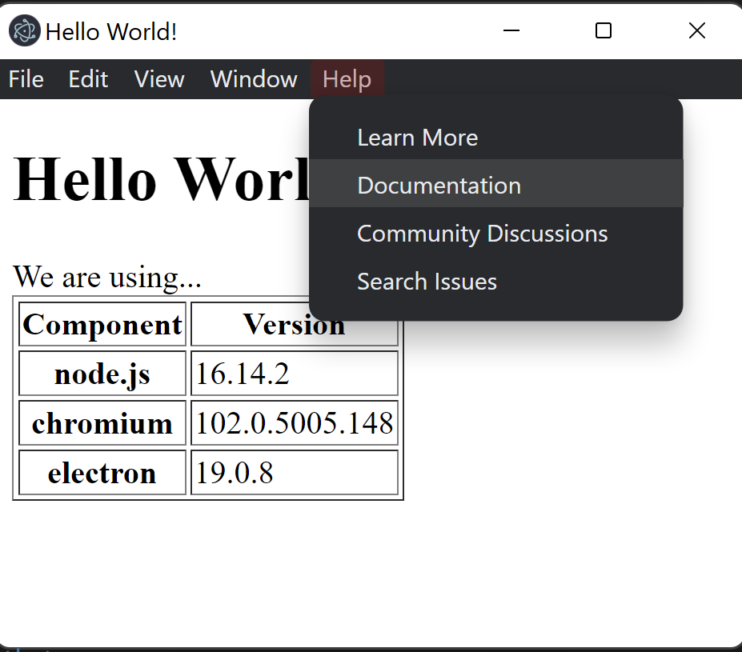

# `electron-tutorial-js-app`

SRC: [Quick Start](https://www.electronjs.org/docs/latest/tutorial/quick-start)

## Setup

### First time

```bash
$> npm run setup
```

### Dependencies

```bash
$> npm install
```

## R&D

### Run

```bash
$> npm start
```

## Build

### package

```bash
$> npm run package
```

### make

```bash
$> npm run make
```

## Sample

### Windows


